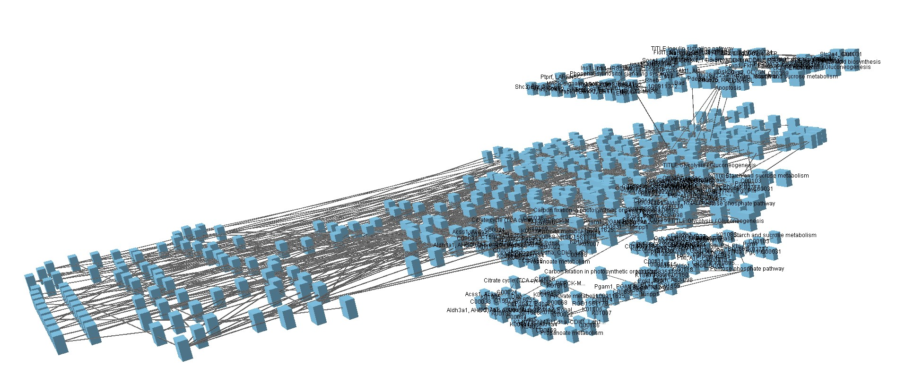

# transomics2cytoscape

## Introduction

Visualization of trans-omic networks helps biological interpretation by
illustrating pathways where the signals are transmitted.

To characterize signals that go across multiple omic layers, [Yugi and
colleagues have proposed a method for network visualization](https://pubmed.ncbi.nlm.nih.gov/25131207/)
by stacking multiple 2D pathways in a 3D space.

The 3D network visualization was realized by [VANTED](https://www.cls.uni-konstanz.de/software/vanted/).
However, the visualization relies on time-consuming manual operation.
Here we propose **transomics2cytoscape**, an R package that automatically creates
3D network visualization in combination with
Cytoscape, [Cy3D App](http://apps.cytoscape.org/apps/cy3d), and
[Cytoscape Automation](https://genomebiology.biomedcentral.com/articles/10.1186/s13059-019-1758-4).

## Installation

```{R}
install.packages("devtools")
devtools::install_github("ecell/transomics2cytoscape")
```

and also you need to install [Cytoscape](https://cytoscape.org/).

## Example

1. Run Cytoscape Desktop
2. Run R[Studio].
3. Run the following R code. This will import multiple networks and integrate the networks to a 3D space.

```R
library(transomics2cytoscape)
networkDataDir <- tempfile(); dir.create(networkDataDir)
sif <- system.file("extdata","galFiltered.sif",package="RCy3")
file.copy(sif, networkDataDir)
networkLayers <- system.file("extdata", "networkLayers.tsv",
    package = "transomics2cytoscape")
transomicEdges <- system.file("extdata", "transomicEdges.tsv",
    package = "transomics2cytoscape")
stylexml <- system.file("extdata", "transomics.xml",
    package = "transomics2cytoscape")
create3Dnetwork(networkDataDir, networkLayers, transomicEdges, stylexml)
```

Then, you should have a 3D view with layered networks and transomic
interactions between them.
(Note that you need to perform operations such as zooming out or adjusting the
camera angle.)



Please see [./vignettes/transomics2cytoscape.Rmd](./vignettes/transomics2cytoscape.Rmd) for more information.
