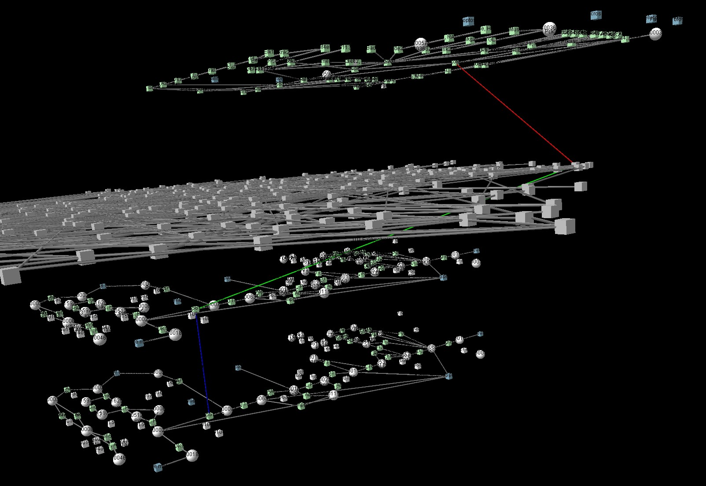

# transomics2cytoscape

## Introduction

To understand transomics datasets, [Yugi et al.
2014](https://pubmed.ncbi.nlm.nih.gov/25131207)
has proposed a method for network visualization
by integrating multiple pathways in 3D space.

The 3D network visualization was created by
[VANTED](https://pubmed.ncbi.nlm.nih.gov/23140568)
and manual operation. transomics2cytoscape automatically
creates the network data for Cytoscape and
[Cy3D](http://apps.cytoscape.org/apps/cy3d) renderer
using
[Cytoscape Automation](https://pubmed.ncbi.nlm.nih.gov/31477170).

## Installation

```{R}
install.packages("devtools")
Sys.setlocale(category = "LC_ALL", locale = "us")
devtools::install_github("ecell/transomics2cytoscape", build_vignettes = FALSE)
```

and also you need to install [Cytoscape](https://cytoscape.org/).

## Example

1. Run Cytoscape Desktop
2. Run R[Studio].
3. Run the following R code. This will get KEGG pathways and import the pathways to Cytoscape and finally integrate the pathways to a CyJS file named "transomics3D.cyjs".

```R
library(transomics2cytoscape)
library(dplyr)
kinase2enzyme <- system.file("extdata", "kinase_enzyme.txt", package = "transomics2cytoscape")
create3Dcyjs(c(rno00010=1, rno00010=200, rno04910=400, rno04910=600), kinase2enzyme, "transomics3D")
getwd()
```

4. Import transomics3D.cyjs in the `getwd()` directory with Cytoscsape GUI.

   

5. Select Cy3D network renderer.

  
  
Now you should see


