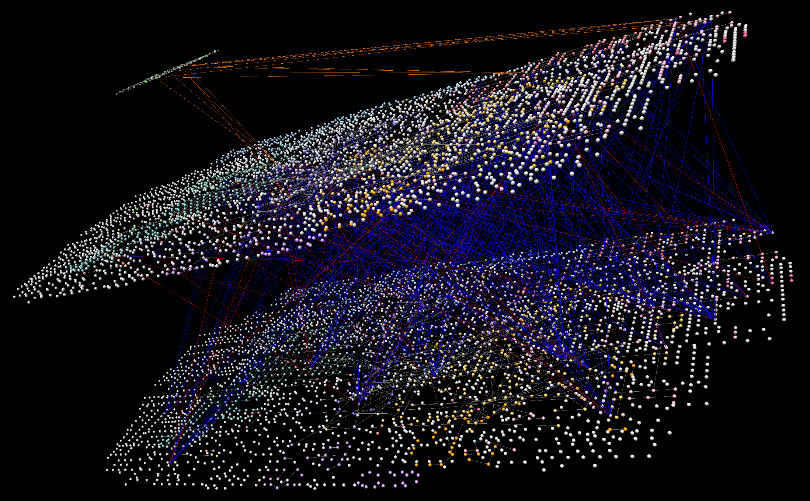

```{r, echo = FALSE}
knitr::opts_chunk$set(
    eval=FALSE
)
```

# Version Information

**R version**: 4.0.2

**Bioconductor version**: 3.13

**Cytoscape**: 3.8.2

**Cy3D (Cytoscape app)**: 1.1.3 (1.1.2 or later is **required**)

**KEGGscape (Cytoscape app)**: 0.9.0

# Introduction

Visualization of Trans-omic networks helps biological interpretation by
illustrating pathways where the signals are transmitted
[@gehlenborg_visualization_2010].

To characterize signals that go across multiple omic layers, Yugi and
colleagues have proposed a method for network visualization
[@yugi_reconstruction_2014] by stacking multiple 2D pathways in a 3D space.

The 3D network visualization was realized by VANTED [@rohn_vanted_2012].
However, the visualization relies on time-consuming manual operation.
Here we propose transomics2cytoscape, an R package that automatically creates
3D network visualization in combination with
Cytoscape [@shannon_cytoscape:_2003],
[Cy3D](http://apps.cytoscape.org/apps/cy3d) App, and
Cytoscape Automation [@otasek_cytoscape_2019].


## Installation

This package requires [Cytoscape](https://cytoscape.org/) to be installed and
you need to run Cytoscape before running the following R code.

```{r}
BiocManager::install(version='devel')
BiocManager::install("transomics2cytoscape")
```

# Workflow

There is two functions `create3Dnetwork` and `createTransomicEdges`
in transomics2cytoscape.
Below is a diagram of the workflow.


`create3Dnetwork` has 3 arguments.

The 1st one is a directory path where you put the network files
to be layered in 3D space.
The 2nd one is a file path of TSV for the Z-axis layout of the network files
(called "Layer definition file").
The last one is a file path of XML used to style Cytoscape.

`createTransomicEdges` has 2 arguments.

The 1st one is the SUID of the network created by `create3Dnetwork`.
The 2nd one is a file path of TSV for the transomic interactions
(called "Transomic interaction file").

## Input files

### 1. (Any number of) network files to be layered in 3D space

Files that Cytoscape can import.
You need to put these files in the directory of the 1st argument of
`create3Dnetwork`.
You don't need to put files for the KEGG pathway.

### 2. Layer definition file

"Layer definition file" is a TSV file for the Z-axis layout of the network
files.

A file that defines network layer index and the Z-height of the network
in 3D space. The format is as follows.

```
layer1  rno04910    2400
layer2  rno01100    1500
layer3  rno01100    1
```

The 1st column is the network layer index.
This information is added to the node table column `LAYER_INDEX`.

The 2nd column is the KEGG pathway ID or the network file name in the directory
of the 1st argument of `create3Dnetwork`.
You don't need to prepare a network file for the KEGG pathway.
You can import the KEGG pathway simply by writing the KEGG pathway ID.
The last column is the Z-height of the network.

### 3. A style file of Cytoscape

A Cytoscape style file.
For more information about Cytoscape style file, see the
[Cytoscape user manual](http://manual.cytoscape.org/en/stable/Styles.html).
Note that you can only use style properties that are supported by Cy3D.


### 4. Trans-omic interaction file

"Trans-omic interaction file" is a TSV file that defines the edges
that connect the different network layers.
The format is as follows.


The 1st ~ 4th columns are the information about the node or edge 
at the "source" of the Trans-omic interaction.

The 5th ~ 8th columns are about the target node.

The 1st and 5th columns are the network layer index.

The 2nd and 6th columns are whether the source and target of the interaction
are node or edge.

The 3rd and 7th columns are the column name of the Cytoscape node or edge
table.

The 4th and 8th columns are the string to be searched from the column
with the name of the 3rd and 7th column.
The Cytoscape node or edge that has the string will be the source or target
of the Trans-omic interaction.

The last column is the type of the Trans-omic interaction.
This information is added to the `interaction` column of the edge table.

## Example

```{r setup}
# suppressPackageStartupMessages(library(dplyr))
# suppressPackageStartupMessages(library(RCy3))
# suppressPackageStartupMessages(library(KEGGREST))
# Sys.setenv(LANGUAGE="en_US.UTF-8") 
library(transomics2cytoscape)
networkDataDir <- tempfile(); dir.create(networkDataDir)
networkLayers <- system.file("extdata", "yugi2014.tsv",
    package = "transomics2cytoscape")
stylexml <- system.file("extdata", "transomics.xml",
    package = "transomics2cytoscape")
suid <- create3Dnetwork(networkDataDir, networkLayers, stylexml)

transomicEdges <- system.file("extdata", "allosteric.tsv",
    package = "transomics2cytoscape")
suid <- createTransomicEdges(suid, transomicEdges)
```

Then, you should have a 3D view with layered networks and transomic
interactions between them.
(Note that you need to perform operations such as zooming out or adjusting the
camera angle.)




## Session information {.unnumbered}

```{r sessionInfo, echo=FALSE}
sessionInfo()
```

# References
