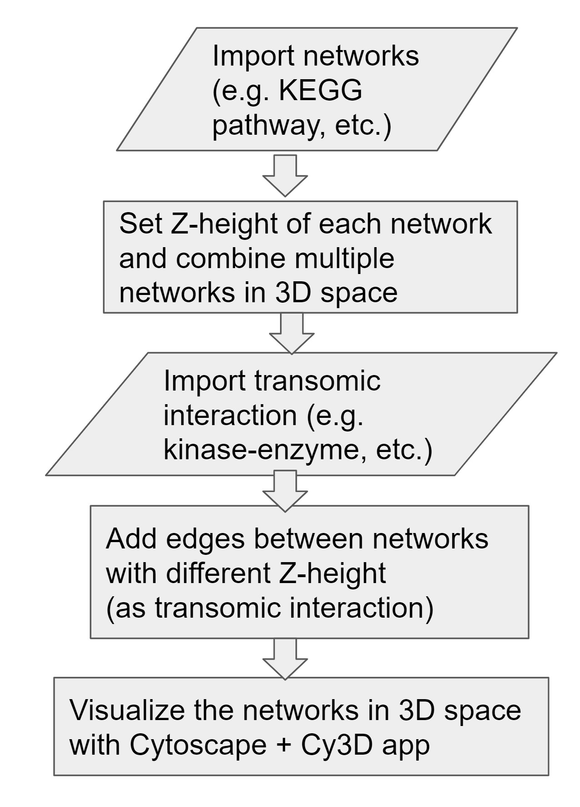

```{r, echo = FALSE}
knitr::opts_chunk$set(
    eval=FALSE
)
```

# Version Information

**R version**: 4.0.2

**Bioconductor version**: 3.11

**Cytoscape**: 3.8.0

**Cy3D (Cytoscape app)**: 1.1.2 (or later is **required**)

**KEGGscape (Cytoscape app)**: 0.8.2

# Introduction

Visualization of trans-omic networks helps biological interpretation by
illustrating pathways where the signals are transmitted
[@gehlenborg_visualization_2010].

To characterize signals that go across multiple omic layers, Yugi and
colleagues have proposed a method for network visualization
[@yugi_reconstruction_2014] by stacking multiple 2D pathways in a 3D space.

The 3D network visualization was realized by VANTED [@rohn_vanted_2012].
However, the visualization relies on time-consuming manual operation.
Here we propose transomics2cytoscape, an R package that automatically creates
3D network visualization in combination with
Cytoscape [@shannon_cytoscape:_2003],
[Cy3D](http://apps.cytoscape.org/apps/cy3d) App, and
Cytoscape Automation [@otasek_cytoscape_2019].


## Installation

This package requires [Cytoscape](https://cytoscape.org/) to be installed and
you need to run Cytoscape before running the following R code.

```{r}
BiocManager::install("transomics2cytoscape")
```

# Workflow

There is a function `create3Dnetwork` in transomics2cytoscape.
In the `create3Dnetwork`, the following workflow is executed.



`create3Dnetwork` has 4 arguments.

The 1st one is a directory path where you put the network files
to be layered in 3D space.
The 2nd one is a file path of TSV for the Z-axis layout of the network files.
The 3rd one is a file path of TSV used to create the edges between the network
layers.
The last one is a file path of XML used to style Cytoscape.

## Input files

### 1. (Any number of) network files to be layered in 3D space

Files that Cytoscape can import.
You need to put these files in the directory of the 1st argument of
`create3Dnetwork`.
You don't need to put files for the KEGG pathway.

### 2. A TSV file for the Z-axis layout of the network files

A file that defines network layer index and the Z-height of the network
in 3D space. The format is as follows.

```
layer1  rno04910    600
layer2  galFiltered.sif 400
layer3  rno00010    200
layer4  rno00010    1
```

The 1st column is the network layer index.
This information is added to the node table column `LAYER_INDEX`.
The 2nd column is the KEGG pathway ID or the network file name in the directory
of the 1st argument of `create3Dnetwork`.
You don't need to prepare a network file for the KEGG pathway.
You can import the KEGG pathway simply by writing the KEGG pathway ID.
The last column is the Z-height of the network.

### 3. A TSV file of trans-omic network edges between the network layers

A file that defines trans-omic interactions
(i.e., the edges that connect the different network layers).
The format is as follows.

```
layer1  rno:84006   layer2  YMR300C transomicsType1
layer2  YMR300C layer3  rno:100364062   transomicsType2
layer3  rno:100364062   layer4  rno:100364062   transomicsType3
```

The 1st and 2nd columns are the information about source node of
the trans-omic interaction.
The 3rd and 4th columns are about the target node.
The 1st and 3rd columns are the network layer index.
The 2nd and 4th columns are the name or KEGG object ID that the node should 
have.
The last column is the type of the trans-omic interaction.
This information is added to the `interaction` column of the edge table.

### 4. A style file of Cytoscape

A Cytoscape style file.
For more information about Cytoscape style file, see the
[Cytoscape user manual](http://manual.cytoscape.org/en/stable/Styles.html).
Note that you can only use style properties that are supported by Cy3D.

## Example

```{r setup}
# suppressPackageStartupMessages(library(dplyr))
# suppressPackageStartupMessages(library(RCy3))
# suppressPackageStartupMessages(library(KEGGREST))
# Sys.setenv(LANGUAGE="en_US.UTF-8") 
library(transomics2cytoscape)
networkDataDir <- tempfile(); dir.create(networkDataDir)
sif <- system.file("extdata","galFiltered.sif",package="RCy3")
file.copy(sif, networkDataDir)
networkLayers <- system.file("extdata", "networkLayers.tsv",
    package = "transomics2cytoscape")
transomicEdges <- system.file("extdata", "transomicEdges.tsv",
    package = "transomics2cytoscape")
stylexml <- system.file("extdata", "transomics.xml",
    package = "transomics2cytoscape")
create3Dnetwork(networkDataDir, networkLayers, transomicEdges, stylexml)
```

Then, you should have a 3D view with layered networks and transomic
interactions between them.
(Note that you need to perform operations such as zooming out or adjusting the
camera angle.)


## Session information {.unnumbered}

```{r sessionInfo, echo=FALSE}
sessionInfo()
```

# References
