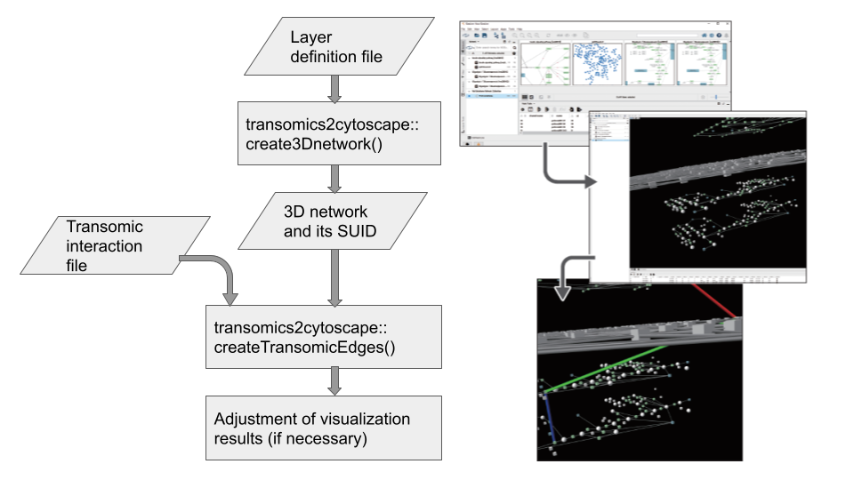

```{r, echo = FALSE}
knitr::opts_chunk$set(
    eval=FALSE
)
```

# Version Information

**R version**: 4.1.3

**Bioconductor version**: 3.15

**Cytoscape**: 3.9.1

**Cy3D (Cytoscape app)**: 1.1.3

**KEGGscape (Cytoscape app)**: 0.9.1

# Introduction

Visualization of Trans-omic networks helps biological interpretation by
illustrating pathways where the signals are transmitted
[@gehlenborg_visualization_2010].

To characterize signals that go across multiple omic layers, Yugi and
colleagues have proposed a method for network visualization
[@yugi_reconstruction_2014] by stacking multiple 2D pathways in a 3D space.

The 3D network visualization was realized by VANTED [@rohn_vanted_2012].
However, the visualization relies on time-consuming manual operation.
Here we propose transomics2cytoscape, an R package that automatically creates
3D network visualization in combination with
Cytoscape [@shannon_cytoscape:_2003],
[Cy3D](http://apps.cytoscape.org/apps/cy3d) App, and
Cytoscape Automation [@otasek_cytoscape_2019].


## Installation

This package requires [Cytoscape](https://cytoscape.org/) to be installed and
you need to run Cytoscape before running the following R code.

```
BiocManager::install("transomics2cytoscape")
```

# Workflow

transomics2cytoscape has 2 main functions
`create3Dnetwork` and `createTransomicEdges`
Below is a diagram of the transomics2cytoscape workflow.



`create3Dnetwork` has 3 arguments.

The 1st one is a directory path where you put the network files
to be layered in 3D space.
The 2nd one is a file path of TSV for the Z-axis layout of the network files
(called "Layer definition file").
The last one is a file path of XML used to style Cytoscape.

For example,
```
suid <- create3Dnetwork(networkDataDir, networkLayers, stylexml)
```

`createTransomicEdges` has 2 arguments.

The 1st one is the SUID of the network created by `create3Dnetwork`.
The 2nd one is a file path of TSV for the transomic interactions
(called "Transomic interaction file").

For example,
```
suid <- createTransomicEdges(suid, layer1to2)
```

## Input files

### (Any number of) network files to be layered in 3D space

transomics2cytoscape can layer all the networks that Cytoscape can import.
You need to put these files in the directory of the 1st argument of
`create3Dnetwork`.
You don't need to put files for the KEGG pathway.
For KEGG pathway, you can import the network just by writing the KEGG
pathway ID in the "Layer definition file" described later.

### Layer definition file

"Layer definition file" is a TSV file for the Z-axis layout of the network
files.

A file that defines network layer index and the Z-height of the network
in 3D space. The format is as follows.

```
layer1  rno04910    2400    false
layer2  rno01100    1500    true
layer3  rno01100    1    false
```

The 1st column is the network layer index.
This information is added to the node table column `LAYER_INDEX`.

The 2nd column is the KEGG pathway ID or the network file name in the directory
of the 1st argument of `create3Dnetwork`.
You don't need to prepare a network file for the KEGG pathway.
You can import the KEGG pathway simply by writing the KEGG pathway ID.

The 3rd column is the Z-height of the network.

The fourth column specifies whether you want to connect the interaction
to the "edge" of the network in that row.
If this is true, transomics2cytoscape will create a node at the midpoint of all
edges of the network.
This is useful when you want to represent an interaction that activates and
inactivates a reaction in the network.
For example, KEGG global metabolic pathway network does not have an enzyme node,
unlike a normal metabolic pathway.
This column should be set to "true" in such cases.

### A style file of Cytoscape

A Cytoscape style file.
For more information about Cytoscape style file, see the
[Cytoscape user manual](http://manual.cytoscape.org/en/stable/Styles.html).
Note that you can only use style properties that are supported by Cy3D.

### Trans-omic interaction file

"Trans-omic interaction file" is a TSV file that defines the edges
that connect the different network layers.
The format is as follows.


The 1st ~ 3rd columns are the information about the node at the "source" of the
transomic interaction.

The 4th ~ 6th columns are about the target node.

The 1st and 4th columns are the network layer index of the source/target node.

The 2nd and 5th columns are the column names for which you want to find the
attribute value of the source/target node.

The 3rd and 6th columns are the attribute values of the source/target node
should have.

The last column is the type of the transomic interaction.
This information is added to the `interaction` column of the edge table.

## Example

You can reproduce Figure5 of
[Yugi 2014](https://www.cell.com/cell-reports/references/S2211-1247(14)00590-7)
with the code below.
This code execution will take some time to complete.
(Do not operate Cytoscape until the code execution is completed.)

```{r setup}
# suppressPackageStartupMessages(library(dplyr))
# suppressPackageStartupMessages(library(RCy3))
# suppressPackageStartupMessages(library(KEGGREST))
# Sys.setenv(LANGUAGE="en_US.UTF-8") 
library(transomics2cytoscape)
networkDataDir <- tempfile(); dir.create(networkDataDir)

networkLayers <- system.file("extdata/usecase1", "yugi2014.tsv",
                            package = "transomics2cytoscape")
stylexml <- system.file("extdata/usecase1", "yugi2014.xml",
                            package = "transomics2cytoscape")
suid <- create3Dnetwork(networkDataDir, networkLayers, stylexml)

layer1to2 <- system.file("extdata/usecase1", "k2e.tsv",
                            package = "transomics2cytoscape")
suid <- createTransomicEdges(suid, layer1to2)

layer3to2 <- system.file("extdata/usecase1", "allosteric_ecnumber.tsv",
                            package = "transomics2cytoscape")
ec2reaction(layer3to2, 6, "allosteric_ec2rea.tsv")
suid <- createTransomicEdges(suid, "allosteric_ec2rea.tsv")
```

Then, you should have a 3D view with layered networks and transomic
interactions between them.
(Note that you need to perform operations such as zooming out or adjusting the
camera angle.)


# Conversion from EC number to KEGG reaction ID

For those who have seen the enzyme reaction database such as
[BRENDA](https://www.brenda-enzymes.org/) [@chang_brenda_2021],
it is not intuitive that the ID of the allosteric regulatory target
(6th column of the `allosteric_ecnumber.tsv`)
is the ID of the metabolic reaction rather than the EC number.

This is because KEGG uses the reaction ID instead of the EC number as the ID of
the pathway object of the global metabolism map.

So transomics2cytoscape has a function `ec2reaction` that converts the EC number
column of the Trans-omic interaction file into the KEGG reaction ID.


```{r}
ecnum <- system.file("extdata", "allosteric_ecnumber.tsv",
    package = "transomics2cytoscape")
ec2reaction(ecnum, 6, "allosteric_ec2rea.tsv")
```

## Example (with more network layers)

transomics2cytoscape can visualize more layers than in the previous example.

You can reproduce a visualiztion of
[Kokaji 2020](https://doi.org/10.1126/scisignal.aaz1236)
with the code below.
(Unfortunately, this paper is not open access and I can't give you the details.)

This code execution will take more time to complete then the previous example.
However, this visualization shows that transomics2cytoscape can also visualize
network not only with the previous 3 layers but also with the 5 layers
(and more than that).

```{r}
networkDataDir <- tempfile(); dir.create(networkDataDir)
tfs <- system.file("extdata/usecase2", "TFs.sif",
                            package = "transomics2cytoscape")
file.copy(tfs, networkDataDir)
networkLayers <- system.file("extdata/usecase2", "kokaji2020.tsv",
                            package = "transomics2cytoscape")
stylexml <- system.file("extdata/usecase2", "Kokaji2020styles.xml",
                            package = "transomics2cytoscape")
suid <- create3Dnetwork(networkDataDir, networkLayers, stylexml)

layer1to2 <- system.file("extdata/usecase2", "s2t_name_updated.tsv",
                            package = "transomics2cytoscape")
suid <- createTransomicEdges(suid, layer1to2)

layer2to3 <- system.file("extdata/usecase2", "t2e_name_updated.tsv",
                            package = "transomics2cytoscape")
suid <- createTransomicEdges(suid, layer2to3)

layer3to4 <- system.file("extdata/usecase2", "e2r_updated.tsv",
                            package = "transomics2cytoscape")
ec2reaction(layer3to4, 6, "e2r_updated_ec2rea.tsv")
suid <- createTransomicEdges(suid, "e2r_updated_ec2rea.tsv")

layer5to4 <- system.file("extdata/usecase2", "m2r_updated.tsv",
                            package = "transomics2cytoscape")
ec2reaction(layer5to4, 6, "m2r_updated_ec2rea.tsv")
suid <- createTransomicEdges(suid, "m2r_updated_ec2rea.tsv")
```


```{r}
sessionInfo()
```

# References
